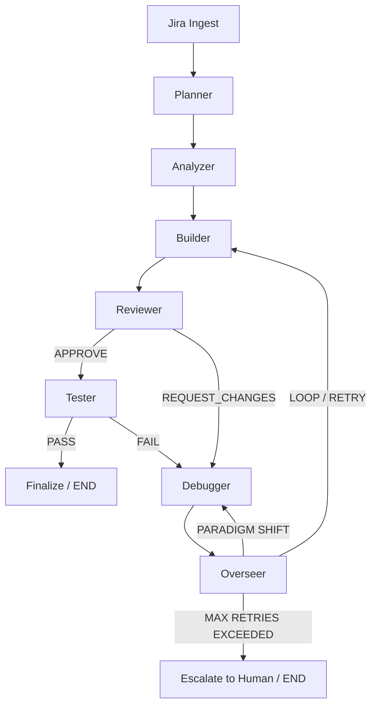

# 🔧 Kernel Coding Agent — Multi-Agent Firmware & Kernel Bug Fixer

Welcome to the **Kernel Coding Agent** repository. This project is a state-of-the-art autonomous multi-agent system built with [LangGraph](https://python.langchain.com/docs/langgraph). It is designed to ingest Jira tickets related to embedded systems, firmware, or the Linux kernel, investigate the codebase, generate patches, test them, and iteratively debug failures until the bug is fixed.

## 📁 Repository Structure & Navigation

This repository is structured linearly to demonstrate the architectural evolution of the system from a basic prototype to an advanced, loop-resistant agent flow. 

If you are new to the codebase, **we recommend exploring the folders in this exact order**:

1. **[`initial_code/`](./initial_code/) (Phase 1 - The Baseline)**
   * **What it is**: The core LangGraph state machine. It introduces the 6 specialized agents (Planner, Analyzer, Builder, Reviewer, Tester, Debugger) and the Overseer.
   * **What to look at**: `src/graph/orchestrator.py` to see the primary StateGraph. `src/core/state.py` for the basic `TypedDict` state.

2. **[`advancements/`](./advancements/) (Phase 2 - ReAct & Structured Outputs)**
   * **What it is**: Eliminates brittle string parsing by upgrading the system to use Pydantic strictly typed outputs.
   * **What to look at**: `src/agents/tester.py` and `builder.py` to see how standard nodes were upgraded into `create_react_agent` subgraphs that can iteratively execute tools on their own.

3. **[`phase3/`](./phase3/) (Phase 3 - Automation & Loop Resistance)**
   * **What it is**: The bleeding-edge baseline. It introduces strict ReAct loop limits and a "Paradigm Shift" mechanism to recover from being stuck in a local minimum.
   * **What to look at**: `src/graph/overseer.py` to see how identical state loops trigger a paradigm shift, and `src/agents/debugger.py` to see how the "Hail Mary" prompt forces the LLM to rethink its entire strategy.

---

## 🗺️ System Architecture

The agent pipeline operates as a cyclic graph.



### The 6 Core Agents
1. **Planner**: Parses the Jira ticket and writes an investigation checklist.
2. **Analyzer**: Uses codebase tools (AST parsing, Semantic RAG) to trace the bug and write a root-cause analysis.
3. **Builder**: Writes a unified diff patch and runs mock builds iteratively until syntax is clean.
4. **Reviewer**: Inspects the patch for concurrency, memory leaks, and kernel style guidelines.
5. **Tester**: Runs checkpatch, static analysis, and mock QEMU boot tests.
6. **Debugger**: Activated only on failure. Reads build logs or kernel panics and prescribes a specific fix for the Builder to retry.

## 🚀 User Guide: Running the Pipeline

To execute the pipeline, we provide a Typer-based CLI tool named `kca`. 
*(Note: Ensure you are running this from inside the `phase3` directory for the latest features)*.

### Setup
```bash
cd phase3
python -m venv .venv
# Activate venv: source .venv/bin/activate (Linux/Mac) or .venv\Scripts\activate (Windows)
pip install -e ".[dev]"
```

### Usage
Run the pipeline against a mock hardware bug:
```bash
# Fix an I2C NULL pointer dereference
kca run --mock profiles/sample_tickets/kern_i2c_null_deref.json --repo /path/to/kernel

# Fix a UART initialization hang
kca run --mock profiles/sample_tickets/fw_uart_init_hang.json
```

### Viewing Long-Term Evolution Memory
The system uses SQLite to remember past fixes for specific subsystems (like `drivers/i2c`). To view what the agent has learned over time:
```bash
kca history
```

## 🛠️ Technology Stack
- **LangGraph & LangChain**: Graph orchestration and LLM tool bindings.
- **Pydantic**: Strict data validation for inter-agent communication.
- **SQLite**: Local evolution memory store.
- **Rich & Typer**: Terminal UI and CLI framework.
