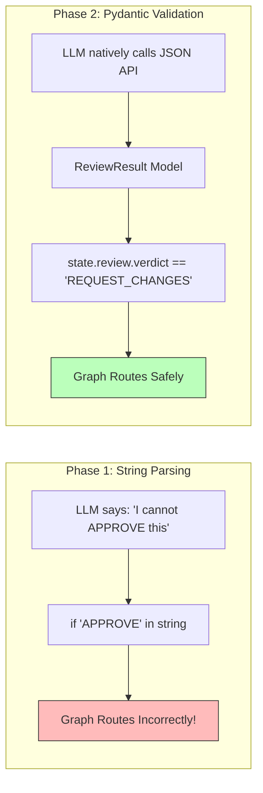
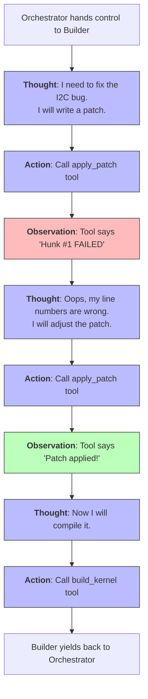

# 🚀 Phase 2: Advancements & Structured ReAct

Welcome to **Phase 2** of the Kernel Coding Agent (`advancements/`). 

In Phase 1, we built a great assembly line, but the agents working on that assembly line were brittle. If an LLM returned slightly conversational text, the whole graph crashed. Furthermore, the Builder and Tester agents were just "guessing" patches instead of interacting with the real world. Phase 2 solves both of these critical flaws, transforming the prototype into an enterprise-grade engine.

---

## 🛡️ Bulletproofing the Graph (Pydantic)

The biggest vulnerability in Phase 1 was relying on the LLM to output predictable text strings. We fixed this by introducing **Structured Outputs** (`.with_structured_output()`) powered by Pydantic.

By binding a Pydantic model (like `ReviewResult`) to the LLM, we force the AI provider (OpenAI, Anthropic, Gemini) to use its native Tool Calling / JSON Mode. 
**The Result**: The LLM physically cannot return conversational filler. It must return a strict enum (`APPROVE` or `REQUEST_CHANGES`). This transforms the LLM from an unpredictable text generator into a deterministic logic gate.

---

## 🧠 True Autonomy (ReAct Subgraphs)

In Phase 1, the Builder just guessed a patch. If it made a syntax error, it wouldn't find out until it traversed the entire global graph, failed the Reviewer, and was analyzed by the Debugger. 

In Phase 2, we upgraded the **Builder** and **Tester** into **ReAct Subgraphs** (`create_react_agent`).

### What is a ReAct Loop?
ReAct stands for **Re**asoning and **Act**ing. It gives the agent "hands" to use tools, and a local loop to fix its own mistakes before yielding back to the main graph.

*   **The Result**: The Builder can now fix its own syntax errors and application failures *internally*. The Tester actively invokes `run_checkpatch` and `run_boot_test` dynamically to gather empirical evidence before returning its final `TestReport` object.

---

## 🛑 The New Vulnerabilities (The Road to Phase 3)

We gave the agents immense power and autonomy in this phase, but with great power comes two new problems:

1.  **The ReAct Loop Trap**: Standard LangGraph ReAct agents are allowed to loop up to 25 times internally. If the Builder gets hopelessly confused (e.g., trying to compile code with a missing header), it might call `build_kernel` 25 times in a row, achieving nothing. This burns massive amounts of API tokens and causes timeout crashes (the "Over-Analysis" problem).
2.  **The Overseer Dead End**: Our Phase 1 Overseer stops infinite global loops, but it does so by just halting the graph completely. A truly autonomous agent shouldn't just give up; it should realize its strategy is failing, wipe its slate clean, and try a completely new approach.

To see how we clamped down on token burning and introduced "Paradigm Shifts" to create a truly unstoppable agent, navigate to the **[`../phase3/`](../phase3/)** directory.
