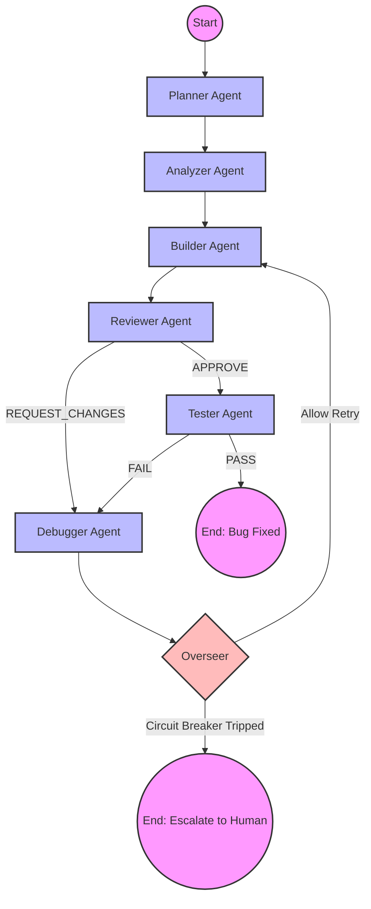
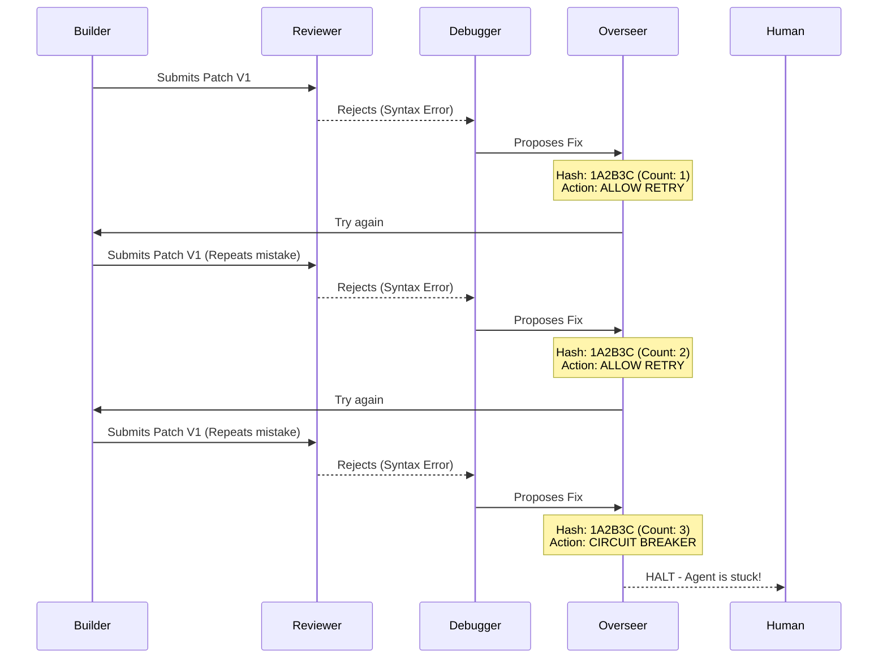

# 🏗️ Phase 1: The Baseline Prototype

Welcome to **Phase 1** of the Kernel Coding Agent (`initial_code/`). 

This directory contains our very first attempt at modeling a human firmware engineer's workflow into an autonomous AI state machine. Think of this phase as a "proof of concept" — it proves that an AI can route tasks between specialized personas, but it lacks the robustness needed for a real production environment.

---

## 🗺️ The Architecture (State Machine)

To understand how this system operates, you have to understand the **LangGraph StateGraph**. Instead of a single chatbot that tries to do everything at once, we built a factory assembly line.

### The 6 Agent Personas
Each box in the diagram above represents a distinct AI agent with a highly specific system prompt:
1.  **The Planner**: The architect. It reads the Jira ticket and writes an investigation checklist.
2.  **The Analyzer**: The code spelunker. It uses basic search tools to find the bug in the source tree.
3.  **The Builder**: The patch author. It generates a unified diff patch.
4.  **The Reviewer**: The strict gatekeeper. It evaluates the patch against kernel coding guidelines.
5.  **The Tester**: The QA bot. It evaluates the patch against static analysis tools.
6.  **The Debugger**: The recovery agent. It reads failure logs from the Reviewer or Tester and tells the Builder what to fix in the next iteration.

---

## 🛡️ The Overseer: Preventing Infinite Loops

If left unchecked, autonomous agents will loop forever. For example: the Builder writes a bad patch, the Reviewer rejects it, and the Builder just writes the exact same bad patch again.

To prevent burning thousands of API tokens, we built **The Overseer**.

*   **How it works**: The Overseer creates a hash of the current patch and review verdict. If it sees the same hash 3 times, it trips the circuit breaker and kills the graph.

---

## 🛑 Why This Phase Is Not Production-Ready

While structurally brilliant, Phase 1 has fatal flaws. We use Phase 1 as a baseline to understand *why* modern AI engineering techniques are necessary.

### Fatal Flaw 1: Brittle String Parsing
Agents communicate by outputting raw strings. The Reviewer outputs text like `"VERDICT: APPROVE"`. The graph routing function parses this using Python logic: `if "APPROVE" in output`. 
If the LLM gets chatty and says *"I cannot APPROVE this patch"*, the routing logic breaks catastrophically.

### Fatal Flaw 2: Fake Tooling (No Autonomy)
The Builder and Tester are just text generators. They don't actually run `make` or `qemu`. They just "hallucinate" passing test results.

### Fatal Flaw 3: Regex Fragility
The `parse_c_symbols` tool uses Regular Expressions to read C code, which instantly breaks when encountering complex Linux kernel macros.

To see how we fixed the brittle parsing and gave the Builder and Tester true autonomy using ReAct and Pydantic, navigate to the **[`../advancements/`](../advancements/)** directory for Phase 2.
