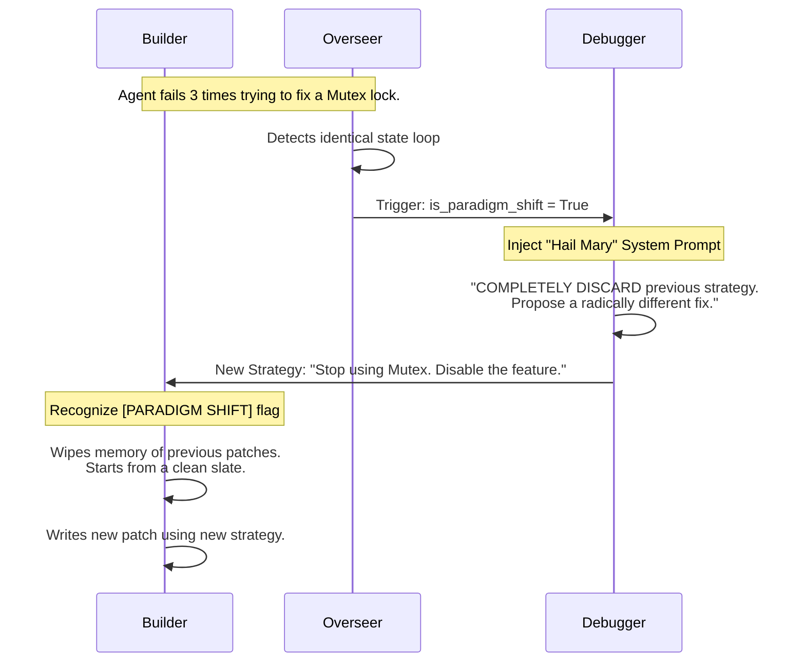
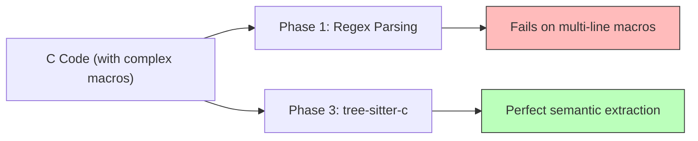

# 🏆 Phase 3: Automation & Loop Resistance

Welcome to **Phase 3**, the bleeding-edge implementation of the Kernel Coding Agent (located in the `phase3/` directory). 

This phase represents a massive leap in autonomy and safety. It directly solves the ReAct "infinite loop" token-burning problem from Phase 2, introduces a highly advanced "Paradigm Shift" recovery mechanism, and prepares the tooling for real Linux kernel integration.

---

## 🛡️ Internal Loop Clamping (Preventing Over-Analysis)

In Phase 2, we gave the Builder and Tester ReAct capabilities so they could fix their own syntax errors. However, by default, LangGraph ReAct agents can loop up to 25 times internally. This meant an LLM could spend 25 turns blindly trying to compile code with a fatal, unfixable syntax error, wasting massive amounts of API tokens.

**The Fix (`src/agents/builder.py`)**: 
We introduced a strict `recursion_limit` parameter to the `invoke()` calls of all ReAct subgraphs.

```python
# Before (Phase 2): Unlimited looping (up to 25)
result = agent.invoke({"messages": [{"role": "user", "content": context}]})

# After (Phase 3): Strict limit
result = agent.invoke(
    {"messages": [{"role": "user", "content": context}]},
    config={"recursion_limit": 5}
)
```
**The Result**: The agent is forced to act decisively. If it cannot fix its own error in 5 steps, it gracefully yields back to the main graph where the specialized Debugger agent can analyze the broader failure. This saves money and prevents timeouts.

---

## 🌪️ Paradigm Shift Automation (The "Hail Mary")

In Phase 1 and 2, the Overseer circuit breaker was great at stopping infinite global loops, but it did so by *halting the entire graph and giving up*. A truly autonomous agent shouldn't just give up; if it is stuck in a local minimum, it should wipe its memory and try a completely different approach.

We implemented the **Paradigm Shift**:



**Step-by-Step Code Flow:**
1.  **The Intercept (`src/graph/overseer.py`)**: When an identical state loop is detected, the Overseer sets `is_paradigm_shift = True` and resets the `retry_count` to give the agent one last chance.
2.  **The Injection (`src/agents/debugger.py`)**: The Debugger recognizes this flag and appends a severe system prompt commanding a radical strategy change.
3.  **The Clean Slate (`src/agents/builder.py`)**: The Builder receives this new radical strategy, drops its context of previous failed patches, and writes entirely new code from scratch.

*If the agent fails again after a Paradigm Shift, only then does the Overseer permanently halt the graph.*

---

## 🛠️ Advanced Tooling Infrastructure (RAG & AST)

We refactored `src/tools/analysis_tools.py` and `codebase_tools.py` to prepare the agent for a real Linux kernel environment.

### AST vs Regex Parsing
In Phase 1, we used Regular Expressions to find C structs and macros. This is incredibly brittle. In Phase 3, we introduced `parse_c_ast`.


*   **The Stub**: `parse_c_ast` is currently a stub designed to interface directly with the `tree-sitter-c` native library for perfect semantic extraction of structs and macros, regardless of weird C-preprocessor formatting.

### Semantic Search (RAG)
*   **The Stub**: We added a `semantic_search` tool to `codebase_tools.py`. This is designed for RAG (Retrieval-Augmented Generation), allowing the Analyzer to query codebase vectors rather than relying on noisy, context-busting `grep` operations.

---

## 🚀 Running Phase 3

Because we use Pydantic and LangGraph, this phase is ready to be run directly from the CLI.

### Setup
Ensure you have initialized the virtual environment at the root of the project:
```bash
cd phase3
python -m venv .venv
# Activate venv: source .venv/bin/activate (Linux/Mac) or .venv\Scripts\activate (Windows)
pip install -e ".[dev]"
```

### Execution
Run the pipeline against the provided mock hardware bugs:
```bash
# Example 1: Fix an I2C NULL pointer dereference
kca run --mock profiles/sample_tickets/kern_i2c_null_deref.json --repo /path/to/kernel

# Example 2: Fix an SPI transfer timeout
kca run --mock profiles/sample_tickets/kern_spi_timeout.json
```

### Checking Evolution History
To view how the agent has learned from past fixes:
```bash
kca history
```
